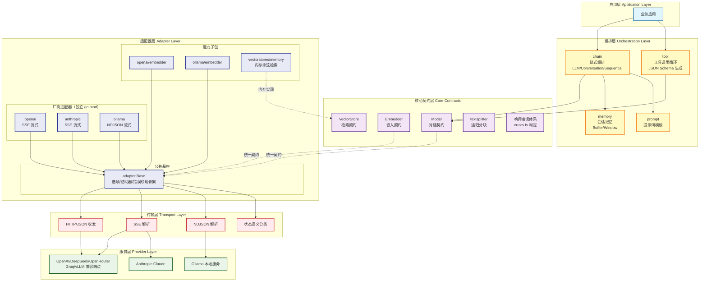

# Go LLM Orchestration (go-llmx) 🚀

[](https://opensource.org/licenses/MIT)
[](https://github.com/kamalyes/go-llmx)
[](https://github.com/kamalyes/go-llmx/releases)
[](https://goreportcard.com/report/github.com/kamalyes/go-llmx)
[](https://pkg.go.dev/github.com/kamalyes/go-llmx?tab=doc)
[](https://github.com/kamalyes/go-llmx/issues)
[](https://github.com/kamalyes/go-llmx/stargazers)
[](https://codecov.io/gh/kamalyes/go-llmx)

**go-llmx** 是一个轻量级 LLM 编排框架，专注于统一多厂商模型接入与业务编排。提供对话/流式/工具调用/嵌入/RAG 检索的完整契约层，协议差异全部下沉适配器子模块按需引入，核心运行时仅依赖 go-logger。

## 🏗️ 系统架构



### 架构特点

- **契约收敛**：`Model`/`Embedder`/`VectorStore` 三契约覆盖全部场景，一个接口方法集对齐所有厂商，无 Deprecated 遗留
- **协议隔离**：wire 编解码/SSE 聚合/NDJSON 解析全部收口在适配器与传输层，业务代码零协议感知
- **差异注入**：适配器公共基座（选项/访问器/错误映射骨架）+ `Classifier` 协议差异注入，新增厂商仅实现差异部分
- **流式统一**：SSE 与 NDJSON 双协议在传输层归一为 `StreamHandler` 单回调，提前终止/容错/聚合语义一致
- **哨兵错误**：网络/限流/鉴权/空响应等语义收敛为哨兵，`errors.Is` 直接判定，无需解析错误串
- **按需引入**：厂商适配器独立 go.mod，业务只拉取实际使用的协议栈；本地部署（Ollama）免密钥
- **全链路可测**：`FakeModel` 内存桩 + httptest 模拟端点，无网络依赖、无 testcontainers

## ✨ 核心特性

### 🎯 统一对话契约

- **极简接口**：`GenerateContent` + `StreamGenerateContent` 两方法覆盖非流式/流式全场景
- **多模态消息**：文本/图片/工具调用统一 `Message`/`Part` 模型
- **请求级选项**：模型覆盖/温度/超时等按调用粒度注入
- **流式回调**：`StreamCollector` 聚合全文，handler 返回 `ErrStopStream` 提前终止且已收内容不丢

### 🔧 工具调用体系

- **循环执行器**：`RunToolLoop` 驱动"模型请求 → 执行 → 结果回传 → 最终回答"闭环，迭代上限防失控自旋
- **零依赖 Schema**：Go 结构体反射生成极简 JSON Schema，无 kin-openapi 传递依赖
- **全厂商支持**：OpenAI tool_calls / Anthropic tool_use 块聚合参数拼接

### 🧠 编排能力

- **链式编排**：LLMChain（模板直出）/ ConversationChain（记忆回写）/ SequentialChain（串行管道）
- **会话记忆**：Buffer 全量 / Window 滑窗，接口开放重型后端扩展
- **提示词模板**：Go `text/template` 极简封装，结构体直接渲染

### 📚 RAG 检索链路

- **嵌入契约**：`Embedder` 文档索引/查询检索双阶段统一
- **递归分块**：分隔符优先级递归 + CJK 友好 + 块重叠
- **向量检索**：内存余弦实现（单测/原型/小规模），`VectorStore` 契约开放 Redis/pgvector 扩展
- **元数据过滤**：等值 Filter 语义，索引与检索阶段解耦

### 🛡️ 错误与可靠性

- **哨兵体系**：12 个语义哨兵覆盖空响应/不可达/鉴权/限流/流终止/工具循环上限等
- **状态分类**：HTTP 状态归一为五类语义（请求非法/鉴权失败/资源不存在/限流/服务端错误）
- **协议错误优先**：厂商错误类型映射优先，未识别按状态分类兜底
- **200 容错**：网关 200 状态注入 error 字段的异常路径全覆盖

## 📦 安装

```bash
# 核心库（契约 + 编排 + 传输）
go get github.com/kamalyes/go-llmx

# 按需引入厂商适配器（独立模块）
go get github.com/kamalyes/go-llmx/adapters/openai
go get github.com/kamalyes/go-llmx/adapters/anthropic
go get github.com/kamalyes/go-llmx/adapters/ollama
```

**系统要求**：Go 1.25+ | 支持 Linux/Windows/macOS

## 🚀 快速开始

### 对话（OpenAI 兼容）

```go
import (
    llmx "github.com/kamalyes/go-llmx"
    lcopenai "github.com/kamalyes/go-llmx/adapters/openai"
)

c := lcopenai.New(os.Getenv("OPENAI_API_KEY"))

// 非流式
resp, _ := c.GenerateContent(ctx, []llmx.Message{llmx.User("用一句话介绍 Go")})
text, _ := llmx.FirstText(resp)

// 流式
var out string
c.StreamGenerateContent(ctx, []llmx.Message{llmx.User("写一首短诗")}, llmx.StreamCollector(&out))
```

切换厂商只换构造：`lcanthropic.New(key)` / `lcollama.New("")`（本地部署免密钥），其余代码零改动。

### 工具调用

```go
tools := []tool.Tool{{
    Name:       "weather",
    Description: "查询城市天气",
    Parameters: tool.SchemaOf(WeatherArgs{}), // Go 结构体 → JSON Schema
    Func:       fetchWeather,
}}

// 循环驱动直至最终回答
resp, err := tool.RunToolLoop(ctx, c, []llmx.Message{llmx.User("北京天气如何")}, tools)
```

### 会话记忆 / RAG 检索

```go
// 记忆：一行接入，多轮上下文自动回写
conv := &chain.ConversationChain{Model: c, Memory: memory.NewWindow(10)}

// RAG：分块 → 嵌入 → 检索，契约自由组合
docs, _ := store.SimilaritySearch(ctx, queryVec, topK, llmx.Filter{"source": "doc-1"})
```

## 🛡️ 错误处理

哨兵错误直接 `errors.Is` 判定，重试/降级策略零字符串匹配：

| 哨兵 | 语义 | 典型处置 |
| --- | --- | --- |
| `ErrRateLimited` | 429 限流 | 指数退避重试 |
| `ErrUnauthorized` | 401/403 鉴权失败 | 轮换密钥 |
| `ErrProviderUnavailable` | 网络不可达 / 404 | 灾备切换端点 |
| `ErrAPIServerError` | 5xx 服务端错误 | 重试或降级 |
| `ErrInvalidRequest` | 400/422 请求非法 | 修正参数 |
| `ErrEmptyResponse` | 空响应 | 业务兜底文案 |
| `ErrStreamClosed` | handler 主动终止 | 正常语义，非故障 |

## 📚 模块导航

| 模块 | 职责 | 引入方式 |
| --- | --- | --- |
| `llmx`（根） | 核心契约 + FakeModel + 哨兵错误 | `go-llmx` |
| `tool/` | 工具调用循环 + JSON Schema 生成 | `go-llmx/tool` |
| `prompt/` | 提示词模板 | `go-llmx/prompt` |
| `memory/` | 会话记忆（Buffer/Window） | `go-llmx/memory` |
| `chain/` | 链式编排（LLM/Conversation/Sequential） | `go-llmx/chain` |
| `textsplitter/` | 递归分块（CJK 友好） | `go-llmx/textsplitter` |
| `transport/` | HTTP/JSON/SSE/NDJSON 传输 + 状态分类 | `go-llmx/transport` |
| `adapter/` | 适配器公共基座（选项/访问器/错误映射） | `go-llmx/adapter` |
| `adapters/openai` | OpenAI 兼容对话 + embedder 子包 | 独立模块 |
| `adapters/anthropic` | Anthropic 对话 | 独立模块 |
| `adapters/ollama` | Ollama 对话 + embedder 子包 | 独立模块 |
| `adapters/vectorstores/memory` | 内存余弦检索 | 独立模块 |

## 🧪 测试与质量

- **语句覆盖**: 全模块 100%（核心库 + 全部适配器 + 能力子包）
- **竞态检测**: `-race` 全量通过
- **测试策略**: httptest 模拟端点，无网络依赖、无 testcontainers、无真实密钥
- **容错覆盖**: 乱序帧/非 JSON 帧/越界载荷/网关 200 错误字段等异常路径全覆盖

```bash
# 全 workspace 回归（竞态 + 覆盖率）
go test ./... -race -cover

# 单模块
cd adapters/openai && go test ./... -race -cover
```

## 🤝 社区与支持

- **问题报告**: [GitHub Issues](https://github.com/kamalyes/go-llmx/issues)
- **功能请求**: [GitHub Discussions](https://github.com/kamalyes/go-llmx/discussions)
- **迁移指引**: [MIGRATION.md](./MIGRATION.md) - langchaingo → go-llmx 对照迁移
- **架构原理**: [docs/ARCHITECTURE.md](./docs/ARCHITECTURE.md) - 各能力实现原理与数据流

### 贡献指南

1. Fork 项目并创建特性分支
2. 补充测试用例（新代码要求 100% 覆盖）
3. 更新文档说明变更内容
4. 提交 Pull Request 等待代码审查

## 📄 许可证

本项目采用 [MIT 许可证](LICENSE) 开源。

---

**⭐ 如果这个项目对你有帮助，请给个 Star 支持一下！**
